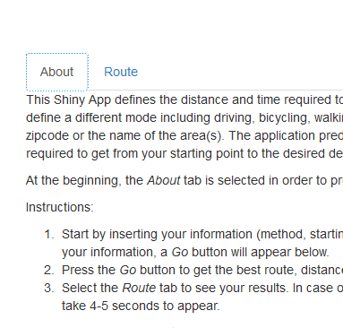
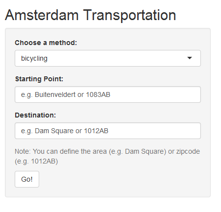
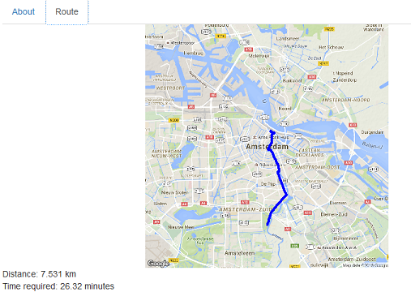

## Introduction

This presentation is part of the peer-assessed project submitted in partial fulfillment of the requirements for the [Developing Data Products][2] course on [Coursera][1]. 

The project is separated into two parts:
 
1. A Shiny App deployed on [Rstudio servers][3]
 
2. A reproducible pitch presentation using [Slidify][4] or [Rstudio Presenter][5]

Access to the application:

[Live version][6] of the application on ShinyApps
 
[Source code and additional explanations][7] for the application on GitHub

[1]: www.coursera.org
[2]: https://www.coursera.org/learn/data-products
[3]: http://www.shinyapps.io/
[4]: www.slidify.org
[5]: https://support.rstudio.com/hc/en-us/articles/200486468-Authoring-R-Presentations
[6]: https://carcheou.shinyapps.io/Amsterdam_Transportation_App/
[7]: www.slidify.org

--- &twocol w1:60% w2:40%

## Calculate time and distance for transportation in Amsterdam 

This app can be used for calculating the distance and time required to go from one point to another in the city of Amsterdam. It can also be used for choosing your transportation method (bicycling, walking, public transportation, car) based on the distance and the time required.
*** =left

*** =right
 
 
The "About" tab is initially selected providing instructions on how the application can be used. 

Follow the instructions carefully before start using the application

--- &twocol w1:40% w2:60%

## Input Information 

*** =left

*** =right

First you need to inform your transportation method, your starting point and destination point. You can use the name of an area or the zipcode of the area. This information will be used to calculate the distance and time required of the best route you can follow.

As soon as all the information is provided, a "Go" button will appear on the screen. Press the button and select the "Route" tab to see your results.

--- 

## Results Information

A map showing the route that you need to follow is presented along with your results for the distance and time required. 

